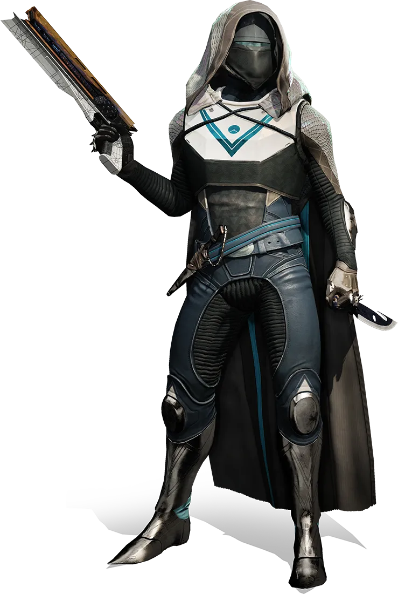
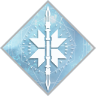
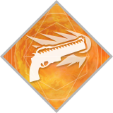
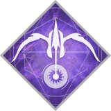

# Hunter Class

| Logo | Crest| Description |
|------|------|-------------|
|  |  | Hunters once prowled the wilderness and wastelands, taking big risks for even bigger rewards. You're no outlaw—at least, not anymore—but making your own luck has always meant bending the rules. Agile and daring, Hunters are quick on their feet and quicker on the draw. |

## Subclass Abilities
| Item | Arc | Solar | Void |
|------|-----|-------|------|
| Subclass | 
**Arcstrider**
Flow like lightning. Strike like thunder. | 
**Gunslinger**
A lone wolf who lives for the perfect shot | 
**Nightstalker**
Draw from the Void. Light the way. |
| Super | 
**Arc Staff**
Form a staff of pure Arc energy and acrobatically take out your foes. | 
**Golden Gun**
Summon a flaming pistol that disintegrates enemies with Solar Light. | 
**Shadowshot**
Tether foes to a Void Anchor, slowing, weakening, and suppressing them for you and your allies. |
| Ability 1 | 
**Marksman's Dodge**
Dodge to perform an evasive maneuver with a steady hand. Dodging automatically reloads your weapon. | 
**Marksman's Dodge**
Dodge to perform an evasive maneuver with a steady hand. Dodging automatically reloads your weapon. | 
**Marksman's Dodge**
Dodge to perform an evasive maneuver with a steady hand. Dodging automatically reloads your weapon. |
| Ability 2 | 
**Gambler's Dodge**
Dodge to perform a deft tumble, avoiding enemy attacks. Dodging near enemies fully recharges your melee ability. | 
**Gambler's Dodge**
Dodge to perform a deft tumble, avoiding enemy attacks. Dodging near enemies fully recharges your melee ability. | 
**Gambler's Dodge**
Dodge to perform a deft tumble, avoiding enemy attacks. Dodging near enemies fully recharges your melee ability. |
| Jump 1 | 
**High Jump**
While airborne, jump a second time to reach greater heights. | 
**High Jump**
While airborne, jump a second time to reach greater heights. | 
**High Jump**
While airborne, jump a second time to reach greater heights. |
| Jump 2 | 
**Strafe Jump**
While airborne, jump a second time with strong directional control. | 
**Strafe Jump**
While airborne, jump a second time with strong directional control. | 
**Strafe Jump**
While airborne, jump a second time with strong directional control. |
| Jump 3 | 
**Triple Jump**
While airborne, sustain your air control with a second or third jump. | 
**Triple Jump**
While airborne, sustain your air control with a second or third jump. | 
**Triple Jump**
While airborne, sustain your air control with a second or third jump. |
| Grenade 1 | 
**Skip Grenade**
A grenade that splits upon impact, creating multiple projectiles that seek enemies. | 
**Incendiary Grenade**
A grenade that sets enemies on fire when it explodes. | 
**Vortex Grenade**
A grenade that creates a vortex which continually damages enemies trapped inside. |
| Grenade 2 | 
**Flux Grenade**
An explosive grenade that deals additional damage when attached to enemies. | 
**Swarm Grenade**
A grenade that detonates on impact, releasing multiple drones that seek nearby enemies. | 
**Spike Grenade**
A grenade that attaches to any surface and emits a torrent of damaging Void Light. |
| Grenade 3 | 
**Arcbolt Grenade**
A grenade that chains bolts of lightning to nearby enemies. | 
**Tripmine Grenade**
An explosive grenade that sticks to surfaces detonates upon enemies who pass through its laser trigger. | 
**Voidwall Grenade**
A grenade that creates a horizontal wall of burning Void Light. |

## Subclass Ability Trees
### Arc - Arcstrider

| **Way of the Warrior** _Top Tree_ | **Way of the Current** _Middle Tree_ | **Way of the Wind** _Bottom Tree_ |
|-----|-------|------|
| 
**Combination Blow**
Kill an enemy with this melee ability to trigger health regeneration and increase your melee damage temporarily.| 
**Tempest Strike**
After sliding, activate this melee ability to unleash a devastating uppercut attack.| 
**Disorienting Blow**
Strike an enemy with this melee ability to disorient the target and nearby enemies. |
| 
**Combat Flow**
Melee kills recharge your Dodge ability.| 
**Ebb and Flow**
Hit a target with an Arc ability to electrify them. Meleeing electrified enemies disorients them and grants grenade, melee and dodge energy.| 
**Focused Breathing**
Sprinting recharges your dodge ability. Increased maximum sprint speed. |
| 
**Deadly Reach**
Dodging increases your melee range, allowing you to lunge further to strike enemies.| 
**Lightning Weave**
Melee hits greatly increase weapon reload speed.| 
**Combat Meditation**
While critically wounded, melee and grenades recharge drastically faster. |
| 
**Lethal Current**
After dodging, each Arc Staff hit creates a damaging lightning aftershock. | 
**Whirlwind Guard**
While wielding your Arc Staff, hold down the Block button to deflect incoming projectiles. Deflecting projectiles triples Arc Staff damage for a short time. | 
**Lightning Reflexes**
You are harder to kill while dodging. |

### Solar - Gunslinger

| **Way of the Outlaw** _Top Tree_ | **Way of a Thousand Cuts** _Middle Tree_ | **Way of the Sharpshooter** _Bottom Tree_ |
|-----|-------|------|
| 
**Proximity Explosive Knife**
Throw a knife that attaches to a surface upon impact and explodes when it detects an enemy nearby. | 
**Knife Trick**
Throw a fan of flaming knives that burn targets on hit. | 
**Weighted Knife**
Throw a knife that deals extra precision damage. Precision knife kills with this melee ability immediately recharge it. |
| 
**Chains of Woe**
Precision kills increase weapon reload speed for you and nearby allies. | 
**The Burning Edge**
While enemies burn, your dodge ability recharges faster. | 
**Practice Makes Perfect**
Enter a trance with each precision hit, reducing the cooldown of your Super. |
| 
**Deadshot**
Significantly improves your ability to hit with Golden Gun. | 
**Playing With Fire**
Destroying burning enemies recharges Knife Trick more quickly. | 
**Knock 'Em Down**
Precision kills increase weapon stability and handling. Your Super does more damage when cast while this buff is active with 20 or more seconds remaining. |
| 
**Six-Shooter**
Golden Gun can be fired quickly up to 6 times. | 
**Barrage**
Vault into the air and unleash a volley of Solar-charged explosive knives. | 
**Line 'Em Up**
Enables precision damage with Golden Gun. Precision hits with Golden Gun generate Orbs of Light, increase its damage and extend its duration. |

### Void - Nightstalker

| **Way of the Trapper** _Top Tree_ | **Way of the Wraith** _Middle Tree_ | **Way of the Pathfinder** _Bottom Tree_ |
|-----|-------|------|
| 
**Snare Bomb**
Throw a Smoke Bomb from a distance with this melee ability. The Smoke Bomb sticks to surfaces and detonates when enemies are near, slowing and disorienting them. | 
**Flawless Execution**
When your health is full, precision kills grant invisibility, truesight and increased melee range. | 
**Vanish in Smoke**
Throw a Smoke Bomb from a distance with this melee ability. The Smoke Bomb creates a smoke cloud that makes you and nearby allies invisible. |
| 
**Keen Scout**
Sprint and Sneak faster, and gain an enhanced Tracker. Tethered enemies are marked for easy tracking. | 
**Shattering Strike**
After performing a Flawless Execution, your melee attacks weaken enemies. | 
**Lockdown**
Grenade effects last twice as long, allowing for strong territorial control and increased damage potential. |
| 
**Deadfall**
The Void Anchors fired from Shadowshot become traps and wait for prey. Void Anchors have increased range and last longer. | 
**Corrosive Smoke**
Throw a smoke bomb from a distance with this melee ability. The smoke bomb slows enemies and damages them over time. | 
**Heart of the Pack**
Killing tethered enemies creates Orbs of Light, and increases Mobility, Resilience, and Recovery for you and nearby allies. |
| 
**Vanishing Step**
Dodging makes you vanish from sight for a short time. | 
**Spectral Blades**
Summon a pair of deadly void blades and stalk the battlefield in a veil of shadows. Press `LB` to perform a quick melee attack. Press `RB` to perform a heavy attack and once again vanish from sight. | 
**Moebius Quiver**
Fire Shadowshot multiple times, in rapid succession. Shadowshot deals massive damage against tethered enemies. |
